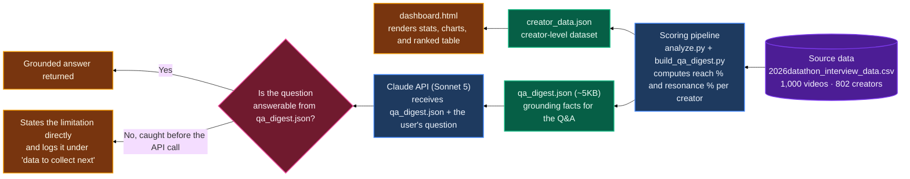

# Trending Creator Signal

Gates Higher Endeavor Technical Assessment

## What it does

This delivers both items the brief requested, on one screen.

1. **At-a-glance summary.** A verdict at the top ("start with these three"), key stats, two charts, and a ranked table.
2. **Plain-English Q&A.** Ask a follow-up question and receive a grounded answer from Claude. Out-of-scope questions are caught instantly, with no API call required. API failures are handled gracefully.

**Prerequisite.** The Q&A feature calls the Anthropic API directly and requires an Anthropic API key from console.anthropic.com. The dashboard itself, including the stats, charts, and table, works without a key.

**To run it.** Open `dashboard.html` in any browser. No installation is required. Enter an Anthropic API key in the field above the Q&A box to enable questions. The key stays in the browser and is never stored or sent anywhere except Anthropic. A light and dark mode toggle is available in the top right.

## Defining "promising"

This dataset has no follower counts, so "promising" is defined using two signals. These two signals are genuinely independent: views and engagement rate show near-zero correlation.

| Bar | What it means | Threshold |
|---|---|---|
| **Resonance** | (likes + comments + shares) ÷ views | Top quartile, 13.3% or higher |
| **Reach** | Total views | Top quartile, 219K views or higher |

A creator must clear both bars. Verified status and repeat trending appearances are treated as confidence signals, not requirements. The dashboard presents this as a working definition and includes two open questions for review: is the goal to identify rising talent or validate established performers, and is this for broad representation or one specific brand deal.

50 of 802 creators clear both bars.

## What the data shows

- **Reach and resonance are independent.** Near-zero correlation between views and engagement rate confirms the two-axis approach is not double-counting the same signal.
- **View concentration is extreme by raw views, not by this method.** The 10 largest accounts by raw views hold 60.2% of all views, a typical creator power-law distribution. The top 10 by this method, selected on reach and engagement together, hold only 1.9% of views. This is by design: the method avoids simply resurfacing the largest accounts.
- **The top 10 by this method outperform proportionally.** They hold 1.9% of views but drive 4.3% of likes and 5.2% of shares, more than double their view share. The raw-views top 10 has an engagement share barely above its view share (62.6% versus 60.2%), close to a 1:1 ratio. That disproportion is the core argument for the method.
- **Content signals.** Longer videos (30 to 60 seconds) outperform shorter ones (7.4% to 11.0% median engagement). Original sound outperforms trending sound (9.1% versus 8.0%). Hashtag presence has no meaningful effect and is not used as a screening criterion.

## How it works

## Keeping the Q&A honest

This works in two layers.

1. **Instant out-of-scope detection.** Five known gaps (follower count, location or demographics, content niche, revenue, and future predictions) are caught by pattern before any API call is made. Each returns a specific, accurate response and notes that it is worth collecting in the future, rather than a generic refusal.
2. **Grounded API calls for everything else.** The model only ever sees the digest, a small and fixed set of verified statistics. It never sees the raw 1,000-row file, so it cannot introduce a number that is not already present. It is instructed to state plainly when the data does not cover something, rather than approximate.

API failures are handled specifically rather than surfacing a raw error. An invalid key, insufficient credit, rate limiting, a server-side issue, and a lost connection each return their own clear, actionable message.

## Data to collect next

- **Location or country.** Would indicate whether top creators cluster geographically, enabling in-person activation such as events, meetups, and studio visits, in addition to remote deals.
- **Follower count.** Separates reach within this single trending batch from actual audience size.
- **Account age or history.** Distinguishes a one-time spike from sustained growth.
- **A structured content taxonomy.** Hashtags are too inconsistent to serve this purpose.

## Known limitations

- No follower counts exist. "Reach" refers to views only, not audience size.
- 88.7% of creators appear only once in this three-month window (September 22 to December 21, 2020). "Consistency" can only be assessed for the 91 creators with repeat appearances.
- Hashtag and content-category data is incomplete and is not used as a scoring signal.
- No location, country, or language data exists. Geographic questions fall outside what this dataset can answer.
- The `author_name` field contains TikTok usernames and handles (for example, `cainguzman`), not verified legal names.
- **The Q&A is currently tied to the Anthropic API.** It calls `api.anthropic.com` directly and requires an Anthropic key. It does not work with OpenAI, a local model, or any other provider as configured.

## Next Steps (Version 2)

1. **Confirm the definition before building further.** Two open questions would shape everything downstream: is the goal to identify rising talent or to validate creators who are already established, and is this for broad representation or fit for one specific brand deal?
2. **Make the Q&A model-agnostic.** The `callClaude()` function in `dashboard.html` is currently wired specifically to Anthropic's Messages API. The brief notes that any model, including local ones, is acceptable. The logical next step is to abstract that function behind a small adapter, so switching to OpenAI, a local model through Ollama, or any OpenAI-compatible endpoint is a one-line change rather than a rewrite.
3. **Add a lightweight settings panel.** A panel for provider, model name, and endpoint, placed alongside the existing API key field, would let a user switch providers without touching code.

## What each file does

1. **Source Data**
   * The original, unmodified export this entire project is built from.
   * Not altered anywhere in this pipeline, and not read directly by `dashboard.html`. The Analysis Pipeline reads it; nothing writes back to it.
   * Files: `2026datathon_interview_data.csv`

2. **Trending Creator Dashboard**
   * The complete, working output. The only file that needs to be opened.
   * Answers both items the brief asked for: an at-a-glance summary and the plain-English Q&A.
   * Files: `dashboard.html`

3. **Analysis Pipeline**
   * Where the definition of "promising" is implemented and calculated.
   * `creator_analysis.py` holds the shared scoring, content-signal, and concentration logic. `analyze.py` and `build_qa_digest.py` both import from it, so the numbers on `dashboard.html` and the numbers the Q&A references come from the exact same calculations, not two separate copies.
   * Already run once. Included so the calculations can be verified or reproduced.
   * Files: `creator_analysis.py` `analyze.py` `build_qa_digest.py`

4. **Data Outputs**
   * Transformed data derived from the raw CSV by the Analysis Pipeline, not the original spreadsheet itself.
   * Read directly by `dashboard.html`: powers everything it renders, and everything the Q&A model inside it is permitted to reference.
   * Files: `creator_data.json` `qa_digest.json` `view_concentration.json` `content_signals.json`

5. **Documentation**
   * This file.
   * Covers the brief's optional items: a short README, a data-flow sketch, and notes on keeping `dashboard.html`'s AI answers accurate and honest.
   * Files: `README.md`

## How they connect

The source spreadsheet is processed by the Analysis Pipeline into the Data Outputs. The Trending Creator Dashboard reads those outputs to render the finished, single-file product. No build step is required to view it.

## Files

- `2026datathon_interview_data.csv`: the original, unmodified source data. Read by `analyze.py` and `build_qa_digest.py`; not read directly by `dashboard.html`.
- `dashboard.html`: the complete deliverable. Open this file to view the summary and use the Q&A. Every other file exists to support this one.
- `creator_analysis.py`: the shared scoring and statistics module. Both `analyze.py` and `build_qa_digest.py` import from it, so the two never compute the same thing two different ways.
- `analyze.py`: reads `2026datathon_interview_data.csv` and produces `creator_data.json`, `view_concentration.json`, and `content_signals.json`, everything `dashboard.html` renders directly.
- `build_qa_digest.py`: reads `2026datathon_interview_data.csv` and produces `qa_digest.json`, the roughly 5KB grounding digest, including content signals and impact analysis, that `dashboard.html` sends to Claude for the Q&A.
- `creator_data.json`: the output of `analyze.py`. Full creator-level data powering `dashboard.html`'s charts and table.
- `qa_digest.json`: the output of `build_qa_digest.py`. The exact digest `dashboard.html` sends with every Q&A question, included here for transparency.
- `view_concentration.json`: the view-concentration curve data behind the second chart on `dashboard.html`.
- `content_signals.json`: duration, sound, and hashtag engagement statistics, plus each top creator's best-performing video, shown on `dashboard.html`.
